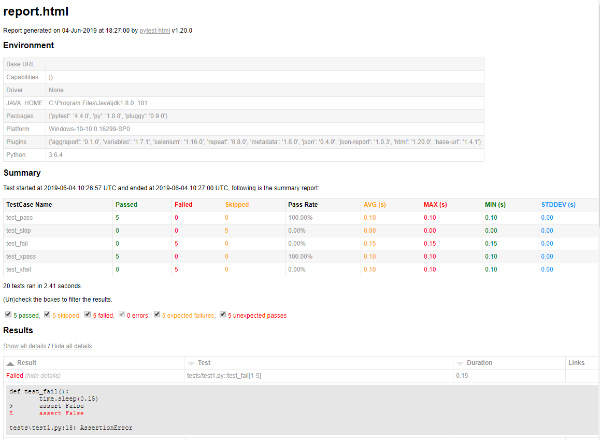

# pytest-aggreport

  

This [pytest](https://github.com/pytest-dev/pytest) plugin was generated with [Cookiecutter](https://github.com/audreyr/cookiecutter) along with [@hackebrot](https://github.com/hackebrot)'s [cookiecutter-pytest-plugin](https://github.com/pytest-dev/cookiecutter-pytest-plugin) template.

## Features

- Generate aggregated test result group by test case name with details;
- Embed test result into html report if pytest-html is available;


## Requirements

- python >= 3.6
- pytest >= 4.3.1
- beautifultable >= 0.7.0
- pytest-repeat >= 0.8.0


## Installation

You can install "pytest-aggreport" via [pip](https://pypi.org/project/pip/) from [PyPI](https://pypi.org/project):

```bash
$ pip install pytest-aggreport
```


## Usage

Pytest will automatically find the plugin and use it when you run pytest with `--count` argument (enable [pytest-repeat](https://github.com/pytest-dev/pytest-repeat) plugin). When test is done, you will see a summary report in the terminal:

```bash
$ pytest --count=5
...
------------------------- aggregate summary report -----------------
+-------------+------+------+-------+--------+-------+-------+-------+---------+
| TestCase Na | Pass | Fail | Skipp | Pass R | AVG ( | MAX ( | MIN ( | STDDEV  |
|     me      |  ed  |  ed  |  ed   |  ate   |  s)   |  s)   |  s)   |   (s)   |
+-------------+------+------+-------+--------+-------+-------+-------+---------+
|  test_pass  |  5   |  0   |   0   | 100.00 |  0.1  |  0.1  |  0.1  |   0.0   |
|             |      |      |       |   %    |       |       |       |         |
+-------------+------+------+-------+--------+-------+-------+-------+---------+
|  test_skip  |  0   |  0   |   5   | 0.00%  |  0.0  |  0.0  |  0.0  |   0.0   |
+-------------+------+------+-------+--------+-------+-------+-------+---------+
|  test_fail  |  0   |  5   |   0   | 0.00%  | 0.15  | 0.15  | 0.15  |   0.0   |
+-------------+------+------+-------+--------+-------+-------+-------+---------+
| test_xpass  |  5   |  0   |   0   | 100.00 |  0.1  |  0.1  |  0.1  |   0.0   |
|             |      |      |       |   %    |       |       |       |         |
+-------------+------+------+-------+--------+-------+-------+-------+---------+
| test_xfail  |  0   |  5   |   0   | 0.00%  |  0.1  |  0.1  |  0.1  |   0.0   |
+-------------+------+------+-------+--------+-------+-------+-------+---------+
...
```

If [pytest-html](https://github.com/pytest-dev/pytest-html) is enabled(run with `--html` argument), then a summary report will also be embedded in the html report:



To disable the plugin, you can use the `-p` argument, for example:

```bash
$ pytest -p no:aggreport
```


## Contributing

Contributions are very welcome. Tests can be run with [tox](https://tox.readthedocs.io/en/latest/), please ensure the coverage at least stays the same before you submit a pull request.


## License

Distributed under the terms of the [MIT](http://opensource.org/licenses/MIT) license, "pytest-aggreport" is free and open source software


## Issues

If you encounter any problems, please [file an issue](https://github.com/hdw868/pytest-aggreport/issues) along with a detailed description.